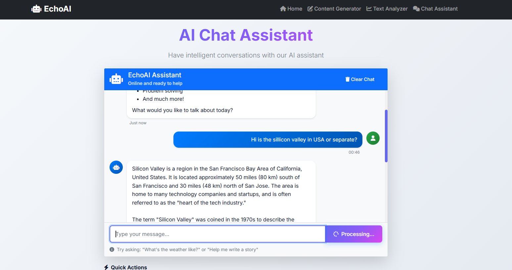

# 🤖 EchoAI - AI-Powered Content Creation Platform

## 👨‍💻 About the Developer

**Abdullah Siddique** - Full Stack Developer & AI Enthusiast

[](https://www.linkedin.com/in/mr-abdullah-siddique/)
[](https://abdullah-siddique-dev.netlify.app/)
[](https://github.com/abdullah90907/EchoAi-Chatbot)

---

## 🚀 Project Overview

EchoAI is a modern, AI-powered Flask web application that revolutionizes content creation and text analysis. Built with cutting-edge technology and a beautiful, responsive UI, EchoAI provides three powerful features to enhance your digital content strategy.

## 📸 Application Screenshots

### 🏠 Home Page

*Modern landing page with gradient animations and feature overview*

### ✍️ Content Generator

*AI-powered social media content creation interface*

### 🤖 Chat Assistant

*Interactive AI chat interface for intelligent conversations*

## ✨ Features

### 🎯 Content Generator
- Generate engaging social media content for multiple platforms (Instagram, LinkedIn, Facebook)
- Customizable brand voice (Professional, Casual, Witty, Inspirational)
- Adjustable content length optimization
- Real-time AI-powered content generation
- Platform-specific content formatting

### 📊 Text Analyzer
- **Sentiment Analysis** - Detailed emotional insights with confidence scores
- **Keyword Extraction** - Extract main topics and phrases from text
- **Text Summarization** - Concise summaries of long content
- **General Analysis** - Comprehensive text evaluation and insights

### 💬 Chat Assistant
- Interactive AI chat interface with natural language processing
- Real-time intelligent responses
- Contextual conversations with memory
- Creative assistance for brainstorming and problem-solving
- Quick action buttons for common tasks

### ✨ Modern UI/UX Design
- **Responsive Design** - Mobile-first approach with Bootstrap 5
- **Beautiful Animations** - Smooth transitions and gradient effects
- **Glass Morphism** - Modern translucent design elements
- **Interactive Elements** - Hover effects and scroll animations
- **Professional Theme** - Cohesive color scheme and typography

## 🔗 Project Links

- **🌐 GitHub Repository**: [EchoAi-Chatbot](https://github.com/abdullah90907/EchoAi-Chatbot)
- **💼 Developer Portfolio**: [Abdullah Siddique](https://abdullah-siddique-dev.netlify.app/)
- **📱 LinkedIn Profile**: [Connect with Abdullah](https://www.linkedin.com/in/mr-abdullah-siddique/)

## 💡 What Makes EchoAI Special

- **Modern Architecture**: Built with Flask blueprints for scalable development
- **AI Integration**: Powered by Groq's advanced Llama AI models
- **Beautiful Design**: Professional UI with glass morphism and gradient effects
- **Production Ready**: Docker support, environment configuration, and deployment scripts
- **Developer Friendly**: Clean code structure, comprehensive documentation, and easy setup

## 🛠️ Tech Stack

- **Backend**: Flask (Python)
- **Frontend**: HTML5, CSS3, JavaScript (ES6+)
- **UI Framework**: Bootstrap 5
- **AI API**: Groq Llama
- **Icons**: Font Awesome 6

## 📁 Project Structure

```
EchoAi-main/
├── app/
│   ├── __init__.py
│   ├── routes.py
│   ├── static/
│   │   ├── css/
│   │   │   └── style.css
│   │   ├── js/
│   │   │   └── main.js
│   │   └── images/
│   │       └── logo.png
│   └── templates/
│       ├── base.html
│       ├── home.html
│       ├── content_generator.html
│       ├── text_analyzer.html
│       └── chat_assistant.html
├── config/
│   └── config.py
├── .env
├── run.py
├── requirements.txt
└── README.md
```

## 🚀 Installation & Setup

1. **Clone the repository**
   ```bash
   git clone <repository-url>
   cd EchoAi-main
   ```

2. **Create a virtual environment**
   ```bash
   python -m venv venv
   venv\Scripts\activate  # On Windows
   # or
   source venv/bin/activate  # On macOS/Linux
   ```

3. **Install dependencies**
   ```bash
   pip install -r requirements.txt
   ```

4. **Set up environment variables**
   - Copy `.env.example` to `.env`
   - Add your Groq API key to the `.env` file
   ```
   GROQ_API_KEY=your_groq_api_key_here
   SECRET_KEY=your_secret_key_here
   ```

5. **Run the application**
   ```bash
   python run.py
   ```

6. **Open in browser**
   Navigate to `http://localhost:5000`

## 🔧 Configuration

### Environment Variables

- `GROQ_API_KEY`: Your Groq API key for AI services
- `SECRET_KEY`: Flask secret key for session management
- `FLASK_ENV`: Environment mode (development/production)
- `FLASK_DEBUG`: Enable/disable debug mode

### API Endpoints

- `GET /` - Home page
- `GET /content-generator` - Content generator page
- `GET /text-analyzer` - Text analyzer page
- `GET /chat-assistant` - Chat assistant page
- `POST /api/generate-content` - Generate social media content
- `POST /api/analyze-text` - Analyze text
- `POST /api/chat` - Chat with AI assistant

## 🎨 Customization

### Styling
The application uses custom CSS with CSS variables for easy theming. Main style file: `app/static/css/style.css`

### Adding New Features
1. Add new routes in `app/routes.py`
2. Create corresponding templates in `app/templates/`
3. Add any necessary JavaScript in `app/static/js/main.js`

## 📱 Mobile Support

EchoAI is fully responsive and optimized for mobile devices with:
- Touch-friendly interface
- Responsive navigation
- Optimized forms and buttons
- Mobile-first design approach

## 🔒 Security Features

- Environment-based configuration
- Input validation
- CSRF protection
- Secure API key handling

## 🚀 Deployment

### Local Development
```bash
python run.py
```

### Production Deployment
1. Set `FLASK_ENV=production` in `.env`
2. Use a production WSGI server like Gunicorn
3. Set up reverse proxy with Nginx (recommended)

## 🤝 Contributing

1. Fork the repository
2. Create a feature branch (`git checkout -b feature/amazing-feature`)
3. Make your changes
4. Commit your changes (`git commit -m 'Add some amazing feature'`)
5. Push to the branch (`git push origin feature/amazing-feature`)
6. Open a Pull Request

## 📄 License

This project is licensed under the MIT License - see the LICENSE file for details.

## 👨‍💻 Developer

**Abdullah Siddique**  
Full Stack Developer & AI Enthusiast

- 🌐 **Portfolio**: [abdullah-siddique-dev.netlify.app](https://abdullah-siddique-dev.netlify.app/)
- 💼 **LinkedIn**: [mr-abdullah-siddique](https://www.linkedin.com/in/mr-abdullah-siddique/)
- 🐙 **GitHub**: [@abdullah90907](https://github.com/abdullah90907)

---

⭐ **If you found this project helpful, please give it a star!** ⭐

---

*Built with ❤️ by Abdullah Siddique using Flask, AI, and modern web technologies*

## 🙏 Acknowledgments

- Groq for providing the AI API
- Bootstrap team for the UI framework
- Font Awesome for the icons
- Flask community for the excellent framework

## 📞 Support

For support, please open an issue in the GitHub repository or contact the development team.

---

**EchoAI** - Empowering creativity with artificial intelligence.
